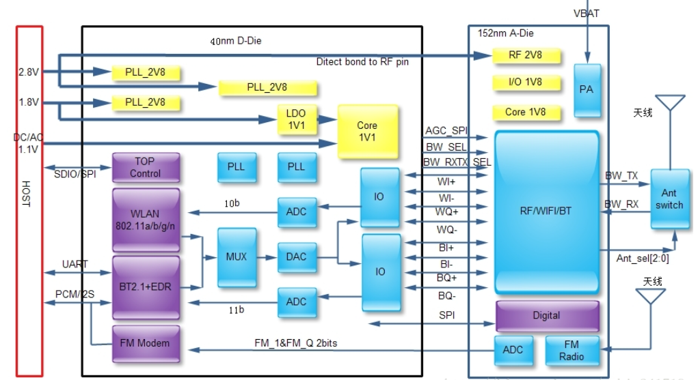

# 						蓝牙原理及软件开发

## 1.蓝牙原理

### 1.1蓝牙概述

 蓝牙，是一种支持设备短距离通信（一般10m内）的无线电技术。能在包括移动电话、PDA、无线耳机、笔记本电脑、相关外设等众多设备之间进行无线信息交换。利用“蓝牙”技术，能够有效地简化移动通信终端设备之间的通信，也能够成功地简化设备与因特网Internet之间的通信，从而数据传输变得更加迅速高效，为无线通信拓宽道路。蓝牙采用分散式网络结构以及快跳频和短包技术，支持点对点及点对多点通信，工作在全球通用的2.4GHz ISM（即工业、科学、医学）频段。

蓝牙的技术特点如下：

（1）、工作频段：2.4GHz的工科医（ISM）频段，无需申请许可证。大多数国家使用79个频点，载频为(2402+k)MHz（k=0，1, 2…78），载频间隔1MHz。采用TDD时分双工方式。
（2）、传输速率：1Mb/s。
（3）、调试方式：BT=0.5的GFSK调制，调制指数为0.28-0.35。
（4）、采用跳频技术：跳频速率为1600跳/秒，在建链时（包括寻呼和查询）提高为3200跳/秒。蓝牙通过快跳频和短分组技术减少同频干扰，保证传输的可靠性。
（5）、语音调制方式：连续可变斜率增量调制（CVSD，ContinuousVariable Slope Delta Modulation），抗衰落性强，即使误码率达到4%，话音质量也可接受。
（6）、支持电路交换和分组交换业务：蓝牙支持实时的同步定向联接（SCO链路）和非实时的异步不定向联接（ACL链路），前者主要传送语音等实时性强的信息，后者以数据包为主。语音和数据可以单独或同时传输。蓝牙支持一个异步数据通道，或三个并发的同步话音通道，或同时传送异步数据和同步话音的通道。每个话音通道支持64kbps的同步话音；异步通道支持723.2/57.6kbps的非对称双工通信或433.9kbps的对称全双工通信。
（7）、支持点对点及点对多点通信：蓝牙设备按特定方式可组成两种网络：微微网(Piconet)和分布式网络(Scatternet)，其中微微网的建立由两台设备的连接开始，最多可由八台设备组成。在一个微微网中，只有一台为主设备（Master），其它均为从设备（Slave），不同的主从设备对可以采用不同的链接方式，在一次通信中，链接方式也可以任意改变。几个相互独立的微微网以特定方式链接在一起便构成了分布式网络。所有的蓝牙设备都是对等的，所以在蓝牙中没有基站的概念。
（8）、工作距离：蓝牙设备分为三个功率等级，分别是：100mW（20dBm）、2.5mW（4dBm）和1mW（0dBm），相应的有效工作范围为：100米、10米和1米。

### 1.2蓝牙的系统构成

1、无线射频单元(Radio)：负责数据和语音的发送和接收，特点是短距离、低功耗。蓝牙天线一般体积小、重量轻，属于微带天线。
2、基带或链路控制单元(LinkController)：进行射频信号与数字或语音信号的相互转化，实现基带协议和其它的底层连接规程。
3、链路管理单元(LinkManager)：负责管理蓝牙设备之间的通信，实现链路的建立、验证、链路配置等操作。
4、蓝牙软件协议实现：如上图紫色部分。

### 1.3蓝牙协议规范

传输协议、中介协议、应用协议；
1、传输协议
 负责蓝牙设备间，互相确认对方的位置，以及建立和管理蓝牙设备间的物理链路；
 底层传输协议：
 蓝牙射频（Radio）部分、基带链路管理控制器（Baseband&Link Controller）、链路管理协议（Link ManagerProtocol LMP）。负责语言、数据无线传输的物理实现以及蓝牙设备间的联网组网。
 高层传输协议：
        逻辑链路控制与适配器（LogicalLink Control and Adaptation Protocol）L2CAP 、主机控制接口（HostControl Interface，HCI）。为高层应用屏蔽了跳频序列选择等底层传输操作，为高层程序提供有效、有利于实现数据分组格式。
2、中介协议
    为高层应用协议或者程序，在蓝牙逻辑链路上工作提供必要的支持，为应用提供不同标准接口。
     串口仿真协议：RFCOMM、服务发现协议：SDP、互操作协议IrDA、网络访问协议：PPP、IP、TCP、UDP、电话控制协议：TCS、AT指令集。

3、应用协议

   蓝牙协议栈之上的应用软件和所涉及到的协议，如：拨号上网、语言功能的应用程序。

### 1.4硬件接口

一般蓝牙芯片通过UART、USB、SDIO、I2S、PcCard和主控芯片通信。如下图所示，通过UART和主控芯片通信。

